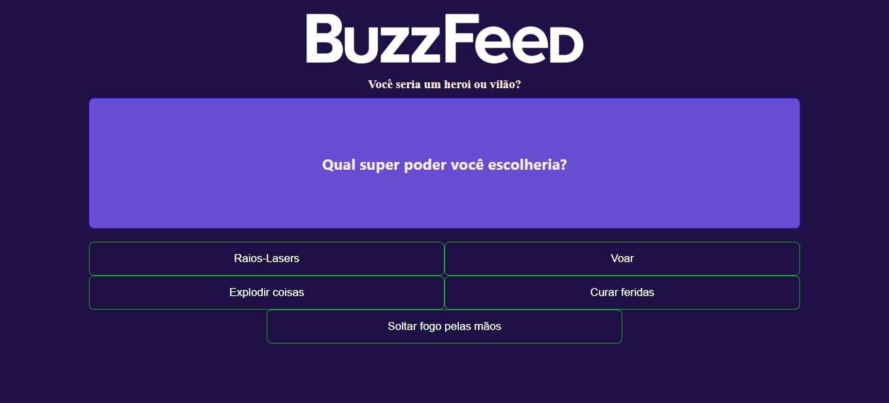

<h1 align="center">
  BuzzFeed
</h1>

  <a href="https://buzz-feed-projeto-dio.vercel.app/">🔗 Live Preview</a>&nbsp;&nbsp;&nbsp;|&nbsp;&nbsp;&nbsp;
  <a href="#-projeto">🖥️ Projeto</a>&nbsp;&nbsp;&nbsp;|&nbsp;&nbsp;&nbsp;
  <a href="#-tecnologias">🚀 Tecnologias</a>&nbsp;&nbsp;&nbsp;|&nbsp;&nbsp;&nbsp;
  <a href="#-license">📝 License</a>

## 💻 Projeto

Projeto do curso "Criando um Clone do BuzzFeed com Angular" da DIO.

## 🚀 Tecnologias

  

## 📝 License

Esse projeto está sob a licença MIT. Veja o arquivo [LICENSE](LICENSE) para mais detalhes.

---
